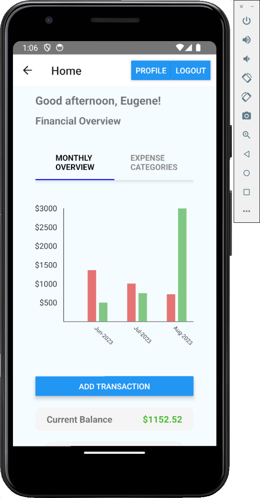
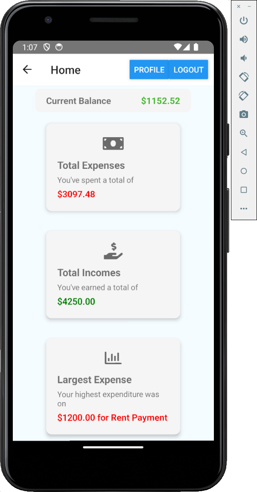
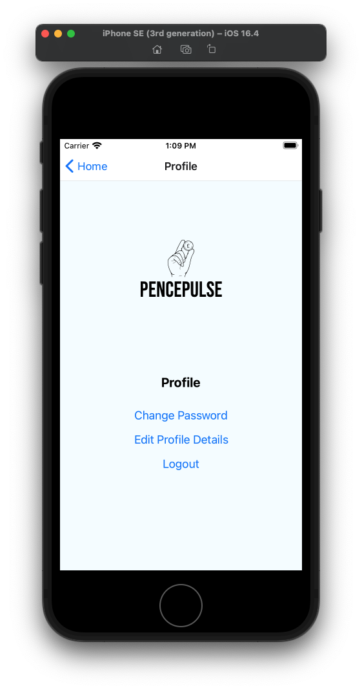

# PencePulse


A personal finance tracker app built using React Native and Node.js.

<div style="display: flex; flex-wrap: wrap; gap: 10px; align-items: center;">
  
  
  
  
  
  
  
  
</div>

## Table of Contents

- [Screenshots](#screenshots)
- [Description](#description)
- [Features](#features)
- [Installation](#installation)
- [Usage](#usage)
- [Contributing](#contributing)

## Screenshots

<div class="screenshot">
  
  <div class="screenshot-description">
    <h4>Home Screen Overview</h4>
    <p>The Home Screen provides a comprehensive snapshot of your financial landscape. With monthly charts and insightful statistics, users can effectively monitor their expenses and incomes. Additionally, a real-time balance calculation ensures instant access to their financial standing.</p>
    <p>The screen displays interactive charts, enabling users to zoom in and out to examine specific time frames. Users can quickly grasp their financial trends, making informed decisions.</p>
    <p>Technologies Used: React Native, Redux, React Navigation, Node.js, Express, MongoDB</p>
    <p>Related Information: The Home Screen showcases the power of React Native for creating responsive and user-friendly interfaces. The integration of Redux enables efficient state management, while React Navigation simplifies navigation within the app.</p>
  </div>
  <br clear="left"/>
</div>

<div class="screenshot">
  
  <div class="screenshot-description">
    <h4>Home Screen Statistics</h4>
    <p>Dive deeper into your financial data with detailed statistics. Explore comprehensive breakdowns of your expenses and incomes, analyzing categories, trends, and financial patterns through intuitive graphical representations.</p>
    <p>The statistics page offers various filtering options, allowing users to focus on specific time periods or expense categories. Users can identify spending trends and adjust their financial strategies accordingly.</p>
    <p>Technologies Used: React Native, Redux, React Navigation, Node.js, Express, MongoDB</p>
    <p>Related Information: The integration of React Native, Redux, and React Navigation ensures a seamless user experience while navigating through the app's extensive statistics and charts. The back-end, powered by Node.js and MongoDB, securely stores and retrieves users' financial data.</p>
  </div>
  <br clear="right"/>
</div>

<div class="screenshot">
  
  <div class="screenshot-description">
    <h4>Profile Page</h4>
    <p>The Profile Page serves as a central hub for managing account settings. Users can easily update their username, password, or perform a logout. This personalized page guarantees a tailored experience for every app user.</p>
    <p>Users can also view a transaction history, empowering them to review their financial activities over time. This helps users maintain an accurate record of their spending and earning patterns.</p>
    <p>Technologies Used: React Native, Redux, React Navigation, Node.js, Express, MongoDB</p>
    <p>Related Information: The Profile Page demonstrates the utilization of React Native's components for creating intuitive forms and interfaces. Redux ensures smooth state management, while Node.js and MongoDB facilitate secure account management and transaction history tracking.</p>
  </div>
  <br clear="left"/>
</div>

## Description

PencePulse is a mobile application built using React Native. The app empowers users to effectively manage their financial journey, providing comprehensive tools for tracking expenses and incomes. Utilizing insightful statistics and user-friendly interfaces, PencePulse offers an unparalleled personal finance experience.

## Features

- User authentication (sign up, log in, profile settings)
- Seamless transaction


## Description

PencePulse is a mobile application built using React Native. The app helps users manage their expenses and incomes, providing insightful statistics and charts to visualize their financial situation. Users can sign up, log in, add transactions, and view their financial overview.

## Features

- User authentication (sign up, log in, profile settings)
- Add transactions with title, amount, category, and type
- Monthly expense and income overview
- Expense category breakdown chart
- Real-time balance calculation
- Responsive and user-friendly design

## Installation

1. Clone this repository:

   ```bash
   git clone https://github.com/Shakhrai8/PencePulse.git
   cd your-project
   ```

2. Install dependencies for the frontend and backend:

   ```bash
   cd frontend
   npm install
   cd ../api
   npm install
   ```

3. Configure your backend:

   Create a .env file in the api directory and set up your MongoDB connection URL.

4. Start the frontend and backend servers:

   ```bash
   # Inside the frontend directory
   npx react-native start

   # Inside the api directory
   npm run start:test
   ```

## Usage

1. Open the app on your Android/iOS device or emulator.
2. On the landing page, you can sign up or log in.
3. After logging in, you'll be directed to the home screen with financial insights.
4. Add transactions to track your expenses and incomes.
5. Explore charts and statistics to manage your finances effectively.


## Contributing

Contributions are welcome! Please fork the repository and create a pull request.